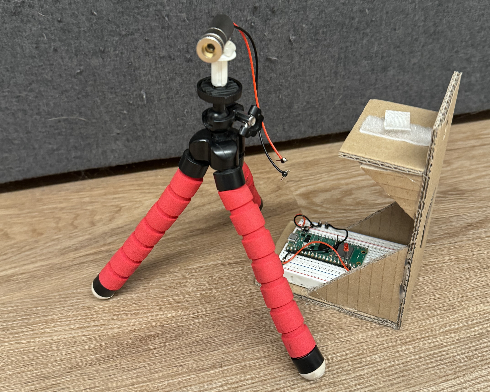
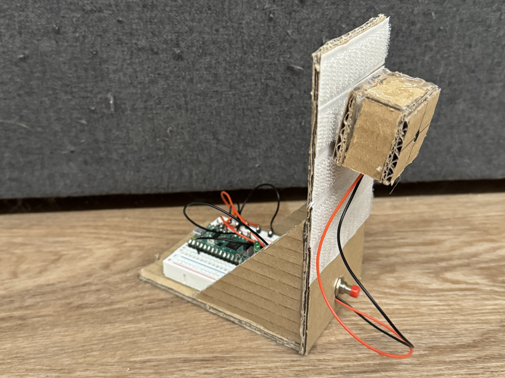

# Code Repository der Wissenschaftspropedeutischen Abschlussarbeit "KOMMUNIKATION MIT LIGHT AMPLIFICATION BY STIMULATED EMISSION OF RADIATION"
von Sebastian von Helmersen

Zugrunde liegende Arbeit: [sebivh.github.io/wsemCode/paper.pdf](https://sebivh.github.io/wsemCode/paper.pdf)

___
In diesem Repository findet sich der Code für zwei selbstgebaute Datenübertragungseinrichtungen auf RP2040 basis.

## Sender:

Der Senden bediehnt den Laser. Er wird durch [boot.py](Emitter/boot.py)

## Empfänger:

Der Reciever Empfäng die Daten und Speichert diese. Er wird durch [boot.py](Receiver/boot.py) gesteuert.

## Ergebnise
Alle ergebnisse sind in [dataFinal.csv](Analyse/dataFinal.csv) zu finden.

## Analyse
Das zur Datenanalyse verwendete Skript befindet sich in [Analyse](Analyse/)

